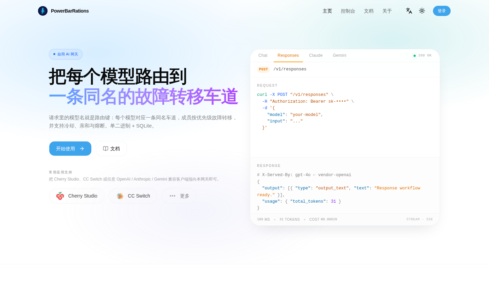
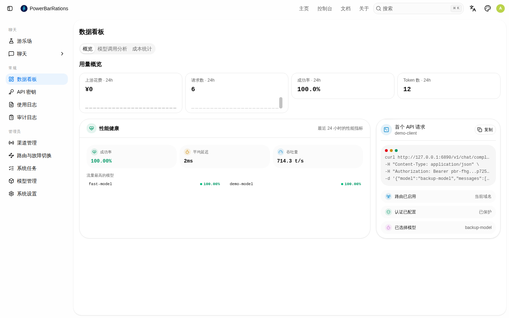
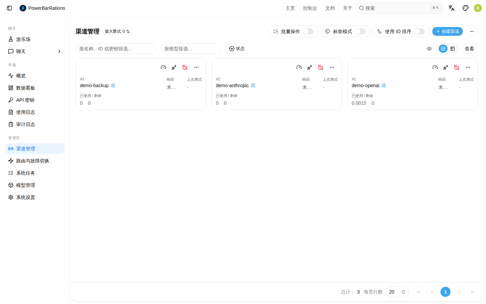
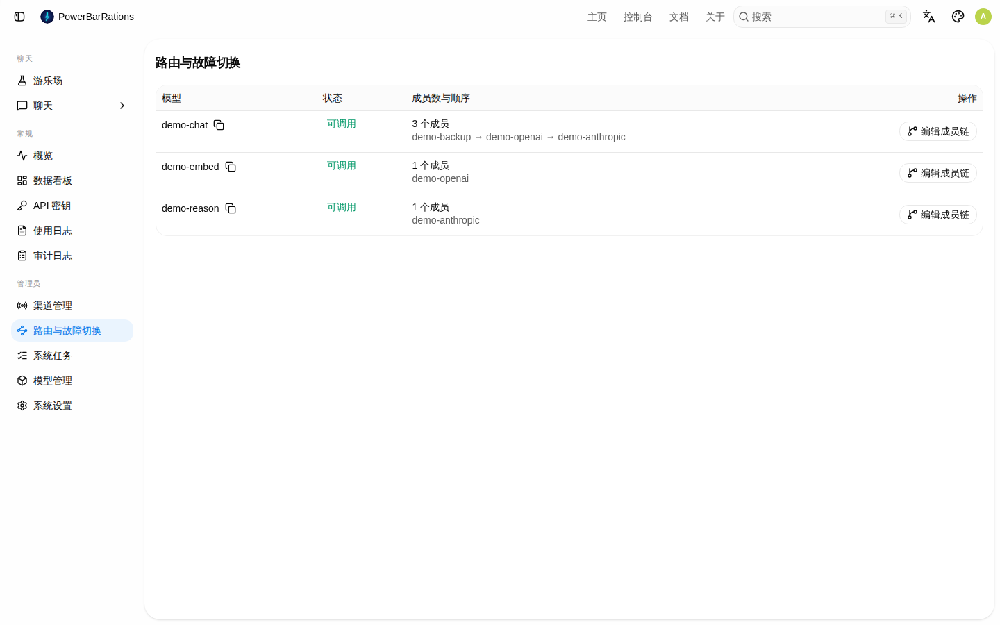
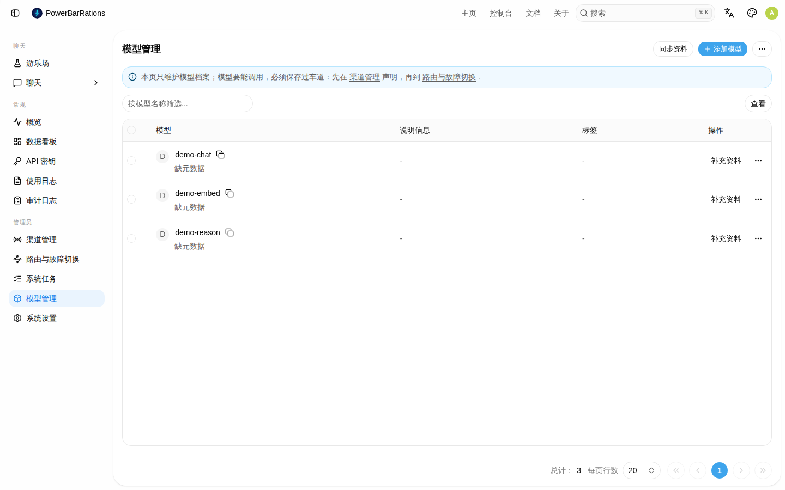
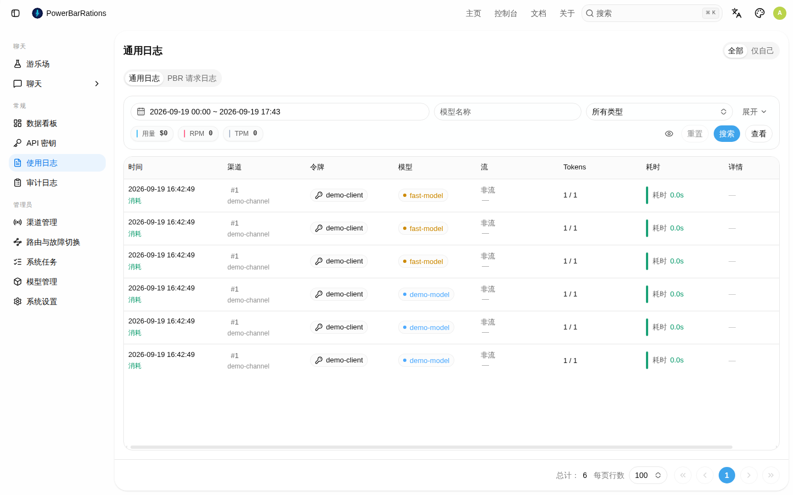
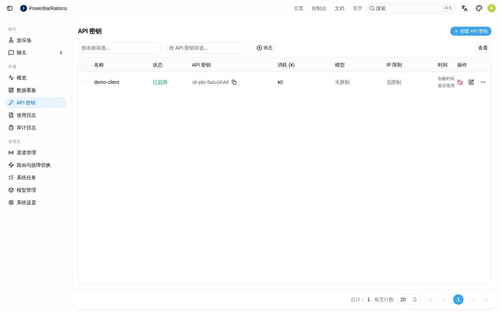
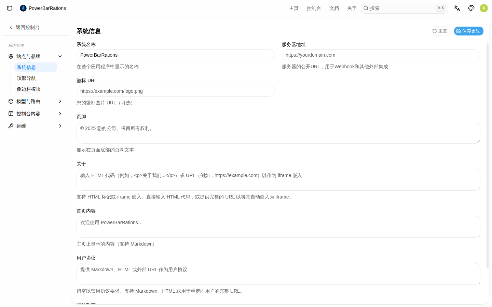

# PowerBarRations

<p align="center">
  
</p>

<p align="center">
  <b>单用户、自用的 LLM 聚合网关：一个二进制、一个 SQLite、一条管道。</b>
</p>

<p align="center">
  <a href="LICENSE"></a>
  
  
  
</p>

<p align="center">
  <a href="#快速开始">快速开始</a> ·
  <a href="#车道与路由">车道与路由</a> ·
  <a href="#访问与密钥">访问与密钥</a> ·
  <a href="#配置项环境变量">配置</a> ·
  <a href="#开发与测试">开发</a> ·
  <a href="#贡献与安全">贡献</a> ·
  <a href="#许可">许可</a>
</p>

> 请求里的 `model` 就是路由键：渠道只声明它提供哪些模型（以及上游真名映射），**车道是唯一
> 路由入口**——把成员链固化成车道后（在「路由与故障切换」页手动新建/编辑，或逐条 `PUT /api/lanes/{model}`），
> 网关按车道顺序做故障转移。没有车道的模型一律 `503`，与"上游全挂"同形；车道支持自定义顺序、
> 成员改名、池化不同上游的不同模型名与两种模式（`failover` 默认 / `manual`）。
>
> 对下游协议零破坏：存量车道名与 `/v1/*` 协议、错误语义一律不变，下游只改 `base_url`。

> **来源与二次开发**：本项目是对 [new-api](https://github.com/QuantumNous/new-api)（转发管道与厂商适配层、控制台前端）与
> [octopus](https://github.com/bestruirui/octopus)（路由顺序、冷却、亲和、熔断语义参考）的**二次开发**，
> 两者均为 **AGPL-3.0** 许可；署名与许可义务见 [`NOTICE`](NOTICE) 与 [`THIRD-PARTY-LICENSES.md`](THIRD-PARTY-LICENSES.md)。

**设计文档（唯一事实来源）**

- 设计基线（架构与取舍）：[`docs/design-v1.md`](docs/design-v1.md)
- 管理 API 契约 + AI 调用手册：[`docs/api-spec-v1.md`](docs/api-spec-v1.md)
- 路由与故障转移：[`docs/routing-spec-v1.md`](docs/routing-spec-v1.md)
- 令牌与认证：[`docs/token-spec-v1.md`](docs/token-spec-v1.md)
- 控制台规格：[`docs/ui-spec-v1.md`](docs/ui-spec-v1.md)
- 关键取舍记录：[`docs/adr/`](docs/adr/)
- 协作规则：[`AGENTS.md`](AGENTS.md)

---

## 特性速览

- **模型即路由键，车道唯一入口**：渠道声明只是候选；没有同名启用车道一律 `503`，宁可失败也不直连某个上游。在路由页手动新建车道并排定成员。
- **优先级故障转移**：成员按顺序取首个可用；失败在尝试预算内重试，之后冷却并逃逸到下一成员。
- **冷却 / 亲和 / 熔断**：六个车道级控制键；熔断三态（`closed/open/half_open`）与半开自愈；亲和默认 0，恢复即切回。
- **四协议双向**：入站与上游都支持 OpenAI Chat、OpenAI Responses、Anthropic、Gemini，按协议自动补全端点路径。
- **安全默认**：管理密钥由登录口令派生（不落库）；客户端密钥明文持久化并另存 `sha256` 索引；请求日志只存元数据。
- **单节点极简**：单个二进制 + 单个 SQLite，无外部数据库 / 缓存 / 队列。
- **上游成本可见**：按渠道 × 模型聚合请求数、token、成功率与上游折算花费（元）；只折算、非计费。
- **可编排全部 HTTP**：管理面完整 API + OpenAPI，适合 AI/脚本无人值守运维；运行态（冷却/熔断）重启清空。

---

## 界面预览

> 以下截图来自**临时演示实例**（假上游 + 演示渠道/车道），不含任何真实渠道或密钥。

| 首页 | 数据看板 |
|---|---|
|  |  |
| **渠道管理** | **路由与故障切换** |
|  |  |
| **模型管理** | **用量日志** |
|  |  |
| **令牌与密钥** | **系统设置** |
|  |  |

---

## 快速开始（Docker）

前置：Docker 与 Compose v2（或裸机：Go 1.25+ / Node.js 22+ / pnpm 11+ / openssl）。

```bash
export PBR_SESSION_SECRET="$(openssl rand -hex 32)"
export PBR_CRYPTO_SECRET="$(openssl rand -hex 32)"
docker compose up -d --build
# 本网关只提供 HTTP（明文），不提供 TLS/HTTPS
curl -s http://127.0.0.1:5700/api/v1/health
```

也可以复制 [`.env.example`](.env.example) 为 `.env` 后填值。

首次使用按顺序做四件事（**全部是 HTTP 调用，不需要改文件、不需要读库**）：

```bash
BASE=http://127.0.0.1:5700         # 明文 HTTP；需要 HTTPS 请自行在前面加反向代理终结 TLS

# 1) 设登录口令 → 签发浏览器会话 Cookie，并返回管理密钥（Base64(SHA256(口令))）
curl -s -X POST $BASE/api/v1/setup -H 'Content-Type: application/json' \
  -d '{"password":"<长随机串，建议 ≥32 字符>"}'
# AI/脚本用管理密钥（也可由口令自行计算，见下方"访问与密钥"）：
export ADMIN_KEY='<上一步返回的 admin_key>'

# 2) 建渠道：声明它提供哪些模型（以及需要时的上游真名映射）
curl -s -X PUT $BASE/api/v1/channels/vendor-a \
  -H "Authorization: Bearer $ADMIN_KEY" -H 'Content-Type: application/json' \
  -d '{"type":"openai","base_url":"https://vendor.example/v1",
       "key":"__INJECT_BY_OPERATOR__",
       "models":["model-1","model-2"],"enabled":true}'

# 3) 固化车道：渠道声明只是候选，必须把成员链固化成车道才可调用
# 在「路由与故障切换」页点「新建车道」手动建（可自定义路由键），或用 PUT 固化单个模型：
# PUT $BASE/api/v1/lanes/model-1  body {"enabled":true,"mode":"failover",
#   "members":[{"channel":"channel-a"},{"channel":"channel-b"}]}

# 4) 建客户端密钥（明文可从管理 API 回读）
curl -s -X POST $BASE/api/v1/keys -H "Authorization: Bearer $ADMIN_KEY" \
  -H 'Content-Type: application/json' -d '{"name":"client-a"}'
```

下游把 `base_url` 指到 `$BASE/v1` 即可；**没固化车道的模型名一律 503**（与"上游全挂"同形）。

### 不用 Docker（手动 docker run / 裸机）

```bash
go build -o pbr .
PORT=5700 \
SQLITE_PATH="./pbr.db?_pragma=busy_timeout(30000)&_pragma=journal_mode(WAL)&_txlock=immediate" \
SESSION_SECRET="$(openssl rand -hex 32)" CRYPTO_SECRET="$(openssl rand -hex 32)" \
./pbr
```

等价的 `docker run`：

```bash
docker run -d --name pbr -p 5700:5700 \
  -e SESSION_SECRET="$(openssl rand -hex 32)" \
  -e CRYPTO_SECRET="$(openssl rand -hex 32)" \
  -v pbr-data:/data powerbar-rations:dev   # 与 compose 默认 tag 一致；也可先 docker build -t powerbar-rations:dev .
```

`PBR_BIND=127.0.0.1` 可把监听收紧到本机（默认 `0.0.0.0`，对局域网开放）。
`PBR_ADMIN_KEY` 可直接指定管理密钥（无头/AI 部署），此时不需要口令派生。

---

## 车道与路由

### 路由键 = 模型名，且**必须先固化车道**

```
渠道/channel-a —— model-1, model-2
渠道/channel-b —— model-1, model-2

固化后（逐条 PUT /api/v1/lanes/{model}，顺序人工排定）：
请求 model-1  →  channel-a 的 model-1  →（失败）→  channel-b 的 model-1
```

- **车道是唯一路由入口**（[ADR 0005](docs/adr/0005-lane-required-and-channel-model-mapping.md)）：
  渠道声明 `models` 只是"候选成员来源"，**不等于可调用**；没有同名启用车道时请求该模型
  一律 `503 No available channel for model <X>`。
- 手动新建：在「路由与故障切换」页点「新建车道」，输入路由键并勾选成员渠道；也可按 §2.2 用 `PUT /api/v1/lanes/{model}` 建/改。
- **渠道没有优先级/权重**（已物理删除）：路由顺序只由车道的成员顺序决定，在侧边栏独立页「路由与故障切换」（`/routes`）里用上移/下移人工排定。
- 上游命名与路由键不一致时，在**渠道**上配 `model_mapping`（路由键 → 上游真名），
  配置一次即对该渠道的所有车道成员生效；成员级 `upstream_model` 可再覆盖它。
- 没有任何渠道声明该模型 → 同样是 `503 No available channel for model <X>`，
  与"上游全挂"**同形**，下游无需分支。
- 请求名带思考后缀（如 `model-1-thinking`）时，原文未命中会按基座既有规则归一化再匹配一次，
  响应里的 `model` 仍是请求原文。

### 车道（唯一入口：顺序 / 改名 / 池化 / 两种模式）

需要自定义顺序、成员改名、或池化不同上游的不同模型名时就写车道：

```bash
curl -s -X PUT $BASE/api/v1/lanes/lane-1 -H "Authorization: Bearer $ADMIN_KEY" \
  -H 'Content-Type: application/json' -d '{
  "enabled": true, "mode": "failover",
  "members": [
    {"channel":"channel-a","upstream_model":"real-name-a","priority":2},
    {"channel":"channel-b","upstream_model":"real-name-b","priority":1}
  ]}'
```

`mode` 两种：`failover`（默认，按成员顺序取首个可用）、`manual`（只用手工指定的
`active_member`，不可用即无可用）。两者共用同一套冷却/熔断/超时与尝试预算。
`weighted` / `round_robin` 与其成员 `weight` 已删除（单用户网关不需要随机/轮询负载均衡）。

### 六键与超时算术

六个键：`member_max_attempts`（单成员含首发的总尝试次数）、`member_retry_interval_seconds`（同成员相邻尝试间隔）、
`member_non_stream_response_timeout_seconds`（非流式整响应超时）、`member_stream_first_event_timeout_seconds`（流式首个事件超时）、
`member_cooldown_seconds`（成员耗尽尝试后被跳过的秒数）、`member_affinity_seconds`（切换成功后保持当前成员的秒数）。
**数值默认值与超时算术的单处规范见 [`docs/routing-spec-v1.md`](docs/routing-spec-v1.md) §1.2、§8**；
默认六键可经 `PUT /api/v1/system/options` 的 `lane_defaults` 调整（只影响新建/一键固化的车道与未显式配置的车道；
已配置的车道以其自身六键为准）。

嫌慢时正确旋钮是 response timeout，而不是砍 attempts。
超时（含"上游一直不返回响应头"）一律按真实失败处理：计入尝试、冷却并换下一个成员。

### 冷却、熔断与亲和

- **冷却**：成员尝试预算耗尽 → 跳过 `member_cooldown_seconds`；到期只放行**一个**探测请求。
- **熔断**：三态 `closed/open/half_open`，按失败计分打开——硬故障权重 1.0、5xx 0.6、
  429 仅 0.2（持续限流不会像硬故障那样快速打开）。退避期到 → 半开放一个探测；
  成功即复通并写恢复事件；重复打开按 `open_seconds × 2^k` 指数退避（设上限）。
- **错误分类**：欠费关键词优先于状态码；`client_error`（请求本身不合法）不冷却、不换人、
  不记熔断分——否则一个坏请求会把健康成员打冷。
- **亲和**：默认 0 = 不做粘滞，故障成员恢复后立刻切回；需要压抖动时按车道显式配置。
- **自动恢复**：`AutomaticEnableChannelEnabled` 默认 `true`（**与旧系统相反**，旧系统默认关闭）。
  它只是"允许把自动禁用的渠道写回 `enabled`"的许可；**真正执行复通的是渠道巡检任务**：
  `monitor_setting.auto_test_channel_enabled` **默认 `false`**（控制台"系统设置 → 系统"里打开），
  或人工点"测试全部渠道"。默认部署下自动禁用也不会发生（`AutomaticDisableChannelEnabled` 默认
  `false`），一旦你打开了自动禁用，请同时打开巡检或记住这条人工恢复路径——否则被自动禁用的渠道
  只会静默地从成员链上消失。
- **全部成员耗尽 → 立即 503 快抛**，不轮询等待、不静默兜底、不跨车道逃逸。
  503 只代表"没有可用渠道"：基座继承的**本机资源过载守卫默认关闭**（`PERFORMANCE_MONITOR_ENABLED=false`），
  避免把"网关所在机器忙"误判成"路由全挂"；需要时可用该环境变量打开并配 `PERFORMANCE_*_THRESHOLD`。

阈值与时长经 `PUT /api/v1/system/options` 配置；`POST /api/v1/lanes/{name}/circuits/reset` 手动清除。
**运行态是进程内的，重启清空**（冷却/熔断/亲和都会重置）。

---

## 访问与密钥

| | 控制台会话（人） | 管理密钥（AI/脚本） | 客户端密钥 |
|---|---|---|---|
| 面向 | 浏览器控制台 | `/api/v1/*` | `/v1/*` 模型流量 |
| 生成 | 登录时服务端签发 **HttpOnly Cookie** | 由登录口令派生：`Base64(SHA256(口令))` | 服务端随机 `pbr-<32 位 base62>` |
| 存储 | 只存 `sha256(管理密钥)`（Cookie 内只有 HMAC 签名） | 不存储；用时现算 | 明文 + `sha256(明文)` 索引 + 展示前缀 |
| 默认权限 | 全量 | 全量 | **允许全部车道**，只能显式拒绝 |

- 管理密钥与客户端密钥**不能**用于模型面/管理面的对方入口。
- **登录两种方式**：浏览器访问控制台输入口令即可（拿到会话 Cookie，**不保存管理密钥**）；
  AI/脚本用口令自行计算管理密钥：`Base64(SHA256(口令))` 作 `Authorization: Bearer`。
  一行：`printf '%s' '<口令>' | openssl dgst -sha256 -binary | openssl base64 -A`
- 口令丢失：`PBR_ADMIN_KEY`（单把）或 `PBR_ADMIN_KEYS`（多把，逗号分隔）环境变量直接指定，
  或 `pbr auth reset --db <pbr.db> --yes` 清掉库内凭据回到未初始化状态（`--yes` 为破坏性动作确认）。
- 口令变更即管理密钥变更，旧密钥立即失效。登录接口对连续失败做指数退避（上限 30s）。
- **本网关只跑明文 HTTP，不提供 TLS/HTTPS**（与上游 new-api 口径一致）。
  安全边界：派生规则（单次 SHA256、无盐）抗离线爆破弱——**口令必须是长随机串**（建议 ≥32 字符）；
  且服务默认监听 `0.0.0.0`，口令/密钥/渠道 key 会明文过网。跨机使用请加外部反向代理终结 TLS，
  或把 `PBR_BIND` 收成 `127.0.0.1` 仅本机访问。

---

## 与旧系统的差异

| 项 | 旧（两代网关） | PowerBarRations |
|---|---|---|
| 层数 | 路由层 + 厂商层两层 | 一层：车道即路由键（模型名） |
| 模型映射 | 厂商层 `model_mapping` 表 | 渠道级 `model_mapping`（路由键 → 上游真名），可由成员级 `upstream_model` 覆盖 |
| 路由入口 | 分组名（没建分组就用不了） | 车道是唯一入口：没固化车道一律 503，在路由页手动新建车道 |
| 限流误判 | 429 与 401 一视同仁 | 分类处理，429 不误伤 |
| 全挂行为 | 轮询等待（请求悬挂） | 503 快抛（下游可分类） |
| 自愈 | 只禁不通，无半开 | 熔断三态 + 半开自动复通 |
| 模式 | manual / failover | failover / manual（`weighted`/`round_robin` 已删） |
| 准入 | 白名单（忘配就 400） | 默认放行 + 显式拒绝 |
| 账号 | 多用户 + 计费 | 单用户、无计费；**令牌只显示「消耗」= 上游折算花费（元），无额度/余额/钱包/订阅** |
| 运维 | 改文件、拷库、抓前端 | 全部 HTTP API + OpenAPI |
| 渠道字段 | 优先级/权重决定选路 | **渠道只有模型清单与上游真名映射**；顺序只在车道上 |
| 模型清单 | 手工录入 | 渠道编辑器内点「探测上游模型」按钮手动拉取 `/models`，按需勾选合并（不自动拉取） |
| 成本视图 | 按渠道/模型单独看 | 看板可按**渠道 × 模型**看花费与 token |
| 控制台冗余入口 | 厂商、部署、模型广场等 | **已删**：供应商与 io.net 部署前后端下线，模型页无"广场展示"，模型页为单一平面列表 |
| 系统信息 | 多节点实例 / Role 面板 | **已删**：单节点 SQLite 部署不需要；原任务面板提为「系统任务」独立页（`/system-tasks`），`/api/system-info/**` 与 `system_instances` 表一并移除 |
| 渠道页命名 | 渠道 | 页面与菜单标题均为**「渠道管理」**；渠道无优先级/权重/分组 |

---

## 运维

```bash
GET  /api/v1/health                     # 存活（免鉴权）
GET  /api/v1/models                     # 全部可路由模型名
GET  /api/v1/routes/{model}             # 某模型的成员链（排障用）
GET  /api/v1/lanes/{name}/health        # 冷却/熔断/亲和快照（含带时间戳事件）
POST /api/v1/lanes/{name}/probe         # 逐成员真实探活
GET  /api/v1/logs?success=false         # 元数据日志（含 attempts 链）
GET  /api/v1/stats?granularity=hour&group_by=lane    # group_by 另有 channel|model|key|channel_model
GET  /api/v1/export                     # 导出配置（不含密钥明文与哈希）
POST /api/v1/import?dry_run=true        # 导入前先看 diff
GET  /api/v1/openapi.json               # 完整契约
```

- **备份**：备份 Docker 卷里的 `pbr.db`（含 `-wal`/`-shm`）即可；也可用 `/export` 导出配置。
- **日志**：只存元数据（车道、成员、尝试链、token 数、耗时、折算金额），
  不存请求/响应正文，不存密钥明文，不存余额。
- **升级**：`docker compose up -d --build`；数据库结构由启动时的迁移自动补齐。

### 传输安全（本服务只提供 HTTP）

**本网关不提供 TLS/HTTPS 服务能力**（设计取舍）：不加载证书、不自签、不热加载，
也没有 `/api/tls/*` 路由与 `TLS_*` 环境变量——启动即以明文 HTTP 监听。

需要 HTTPS 时，**在外部反向代理终结 TLS**（Nginx / Caddy / 云负载均衡），再代理到本服务的明文端口：

```nginx
server {
  listen 443 ssl;
  server_name pbr.example.com;
  ssl_certificate     /path/fullchain.pem;
  ssl_certificate_key /path/privkey.pem;
  location / { proxy_pass http://127.0.0.1:5700; proxy_set_header Host $host; }
}
```

- 走代理时用 `SESSION_COOKIE_SECURE=true` 让会话 Cookie 带 `Secure`（网关自己不会自动加）；
  **它必须与 `SESSION_COOKIE_TRUSTED_URL` 成对设置**（逗号分隔的 `https://` 站点源，如 `https://pbr.example.com`），
  只设前者会因缺少可信源导致进程启动即 `log.Fatal`。
- **不要**把明文端口直接暴露到不可信网络：管理口令衍生弱（单次 SHA256、无盐），
  且请求里含渠道 key 与客户端密钥。至少把 `PBR_BIND` 收成 `127.0.0.1`，或用上面的代理。
- **首启顺序**：未初始化时 `POST /api/v1/setup` 免鉴权，**先到者即可设定口令接管**。
  因此建议先以 `PBR_BIND=127.0.0.1` 本机完成 setup，确认后再放开监听。

### CLI 子命令

```bash
./pbr                        # 启动网关
./pbr migrate --routing <octopus.db> --vendor <new-api.db> --target <pbr.db> \
              --report /tmp/report.json --keys octopus|newapi|both [--dry-run]
./pbr auth reset --db <pbr.db> --yes   # 清库内管理凭据→回到未初始化（破坏性，需 --yes）
```

- `migrate` 的 `--keys` 只接受 `octopus|newapi|both`，非法值 `exit 2`；同名不同明文的客户端密钥会被
  自动改名并在报告 `duplicate_key_names` 留痕（详见 [`MIGRATION.md`](MIGRATION.md)）。
- `auth reset` 的 `--db` 缺省取 `$SQLITE_PATH`；也可用 `PBR_ADMIN_KEY`/`PBR_ADMIN_KEYS` 临时覆盖口令派生。

---

## 配置项（环境变量）

### Docker Compose（`.env` / 宿主机环境）

| 变量 | 默认 | 说明 |
|---|---|---|
| `PBR_SESSION_SECRET` | 必填 | 会话签名密钥，64 位十六进制；映射为容器内 `SESSION_SECRET` |
| `PBR_CRYPTO_SECRET` | 必填 | 字段加密密钥，64 位十六进制；映射为容器内 `CRYPTO_SECRET` |
| `PBR_PORT` | `5700` | 宿主机映射端口 |
| `PBR_BIND` | `0.0.0.0` | 容器内监听地址；收成 `127.0.0.1` 仅本机 |
| `PBR_VERSION` | `dev` | 镜像 tag 与构建注入版本 |
| `PBR_GOPROXY` | `https://goproxy.cn,direct` | 构建期 Go module 代理 |
| `PBR_ADMIN_KEY` | 空 | 可选：直接指定管理密钥（覆盖口令派生） |
| `PBR_ADMIN_KEYS` | 空 | 可选：多把管理密钥，逗号分隔（轮换过渡） |

### 直接运行二进制

| 变量 | 默认 | 说明 |
|---|---|---|
| `PORT` | `5700` | 监听端口 |
| `SQLITE_PATH` | `/data/pbr.db?...` | SQLite 路径；建议保留 WAL / busy_timeout 参数 |
| `SESSION_SECRET` / `CRYPTO_SECRET` | 必填 | 同 Compose 中的 `PBR_*` 两项 |
| `PBR_BIND` | `0.0.0.0` | 监听地址 |
| `SESSION_COOKIE_SECURE` | `false` | 走 HTTPS 反代时设为 `true`（必须与下一项成对） |
| `SESSION_COOKIE_TRUSTED_URL` | 空 | `SESSION_COOKIE_SECURE=true` 时必填：逗号分隔的 `https://` 站点源 |
| `ANONYMOUS_REQUEST_BODY_LIMIT_KB` | `2048` | 管理面（`/api`）请求体上限（KB）；模型面另有 `MAX_REQUEST_BODY_MB`（默认 128） |
| `PERFORMANCE_MONITOR_ENABLED` | `false` | 本机资源过载守卫（默认关闭，避免误判路由全挂） |
| `VERSION` | 空 | 运行时覆盖版本号（构建期由 ldflags 注入） |

完整取值与语义见 [`docs/api-spec-v1.md`](docs/api-spec-v1.md) 与 [`docs/token-spec-v1.md`](docs/token-spec-v1.md)。

---

## 开发与测试

环境：Go 1.25+、Node.js 22+、pnpm 11+（SQLite 随二进制内置）。

```bash
# Go：构建、静态检查、测试
go build ./...
go vet ./...
go test ./... -count=1

# 控制台：依赖、类型、lint、格式、版权头、测试、构建
cd web
pnpm install --frozen-lockfile
pnpm typecheck
pnpm lint            # 必须 0 error
pnpm format:check
pnpm copyright:check
pnpm test
pnpm build
```

端到端验收脚本在 [`verify/`](verify/)（`w0`-`w5`、`final/`、`deploy/`），每个目录的 README 写明了检查项与最近一次实测结论。
改动路由/故障转移/管理面时，请对应复跑相关脚本。提交规范与流程见 [`CONTRIBUTING.md`](CONTRIBUTING.md) 与 [`AGENTS.md`](AGENTS.md)。

### 项目结构

```
main.go            程序入口（含 //go:embed web/dist）
common/ constant/  版本、常量、环境读取
internal/          路由核心、鉴权、管理面 API、legacy 迁移
controller/ model/ service/ setting/   管理面与持久化
relay/ relaykit/   上游转发管道与厂商适配层（移植自 new-api，AGPL）
middleware/        鉴权、跨域、性能等中间件
router/            HTTP 路由装配与静态资源
i18n/ logger/ pkg/ types/ dto/         基础设施
web/               控制台（React + Rsbuild；构建产物 web/dist 由 Go embed）
docs/              设计规范（唯一事实来源）与 ADR
verify/            分波次端到端验收证据
```

---

## 上游参考与致谢

`reference/` 为只读参考，不入本仓库（见 [`.gitignore`](.gitignore)）：

| 目录 | 来源 | revision | 用途 |
|---|---|---|---|
| `new-api` | QuantumNous/new-api | `main@04c64734` | 转发管道与厂商适配层复用来源（W0 已迁入为基座） |
| `octopus-bestrui` | bestruirui/octopus | `e7a1455`（钉线上镜像） | 线上路由层真实上游；车道/冷却/亲和语义基准 |
| `octopus-hureru-fork` | Hureru/octopus | `dev@0e1a7ee` | 仅熔断器三态算法的设计参考（schema 已分叉） |

感谢上述开源项目：转发管道与控制台前端复用自 new-api，路由顺序 / 冷却 / 亲和 / 熔断语义参考 octopus。

---

## 贡献与安全

- 贡献流程、环境与门禁：[CONTRIBUTING.md](CONTRIBUTING.md)
- 行为准则：[CODE_OF_CONDUCT.md](CODE_OF_CONDUCT.md)
- 安全策略与私密报告通道：[SECURITY.md](SECURITY.md)（**安全漏洞不要开公开 Issue**）
- 变更记录：[CHANGELOG.md](CHANGELOG.md)

## 许可

本项目是对 [new-api](https://github.com/QuantumNous/new-api) 与 [octopus](https://github.com/bestruirui/octopus) 的**二次开发**（两者均为 AGPL-3.0），保留其 AGPL 版权头、
[`LICENSE`](LICENSE)、[`NOTICE`](NOTICE) 与 [`THIRD-PARTY-LICENSES.md`](THIRD-PARTY-LICENSES.md)。
品牌可替换，版权不可替换。路由顺序 / 冷却 / 亲和 / 熔断语义参考 [octopus](https://github.com/bestruirui/octopus)。

以 [AGPL-3.0](LICENSE) 发布。贡献即表示同意按同一许可发布。

> **合规提示**：AGPL-3.0 §7(b) 要求保留上游署名。发布二进制或镜像时请同时分发
> [`LICENSE`](LICENSE)、[`NOTICE`](NOTICE) 与 [`THIRD-PARTY-LICENSES.md`](THIRD-PARTY-LICENSES.md)；
> 控制台「关于 / 法律」页须保留 `NOTICE` 指定的署名句与上游项目链接。

---

<details>
<summary><b>English</b></summary>

**PowerBarRations** is a single-user, self-hosted LLM aggregation gateway: one binary, one SQLite,
one pipeline. The `model` in the request **is** the route key. Channels only declare which models
they serve (plus optional upstream-name mapping); every model needs a same-named **lane** — the only
routing entry point. Lane members fail over by priority, with cooldown, affinity, and a three-state
circuit breaker. A model without a lane always returns `503`, so downstream clients need no special
case. Four protocols are supported on both the inbound and upstream sides: OpenAI Chat, OpenAI
Responses, Anthropic, and Gemini. The admin key is derived from the login passphrase; client keys
are stored as hashes only. Cost is upstream spend in CNY derived from hourly aggregates — reporting,
not billing.

See [Quick start](#快速开始) for Docker usage, and [`docs/`](docs/) for the full specifications
(Chinese). Contributions, bug reports, and security reports are welcome — see
[CONTRIBUTING.md](CONTRIBUTING.md) and [SECURITY.md](SECURITY.md).

</details>
